**Задание 1
Что нужно сделать:

1. Установите себе jenkins по инструкции из лекции или любым другим способом из официальной документации. Использовать Docker в этом задании нежелательно.
2. Установите на машину с jenkins golang.
Используя свой аккаунт на GitHub, сделайте себе форк репозитория. В этом же репозитории находится дополнительный материал для выполнения ДЗ.
3. Создайте в jenkins Freestyle Project, подключите получившийся репозиторий к нему и произведите запуск тестов и сборку проекта go test . и docker build ..
В качестве ответа пришлите скриншоты с настройками проекта и результатами выполнения сборки.


**ОТВЕТ**
1. Устанавливаем Jenkins: 
```ansible-playbook -i inventory.ini jenkins_install.yml```
https://github.com/htment/HOMEWORK_CICD/tree/master/ANSIBLE_JENKINS
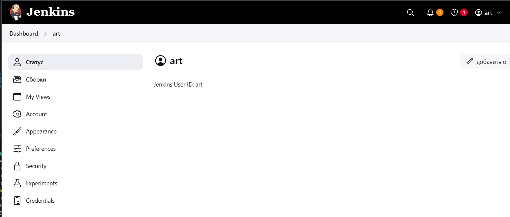

Создаем pipeline


устраняем ошибки
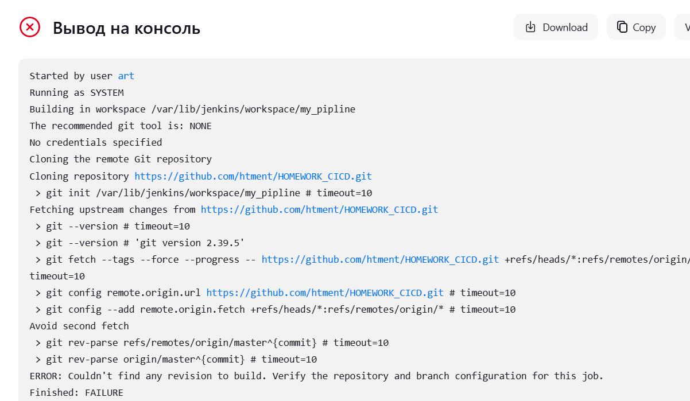
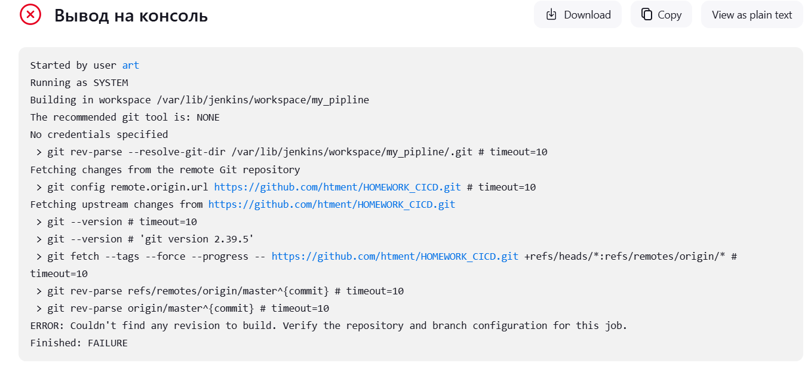
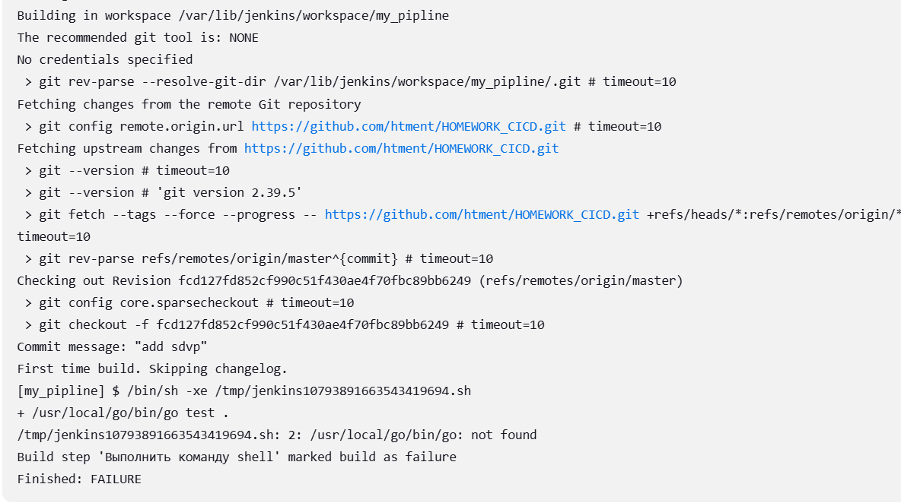
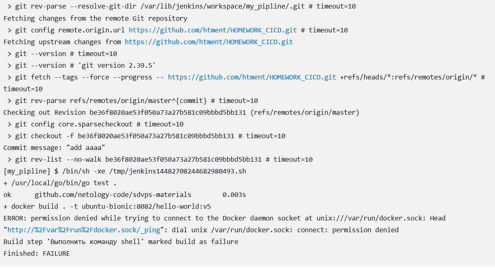
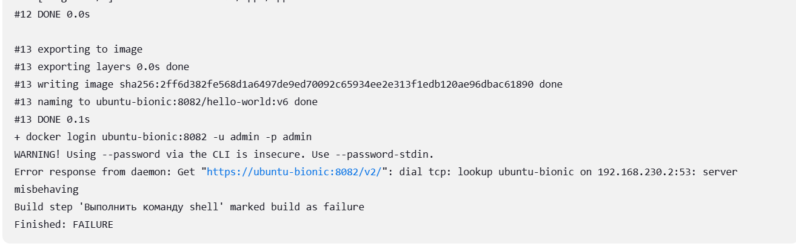
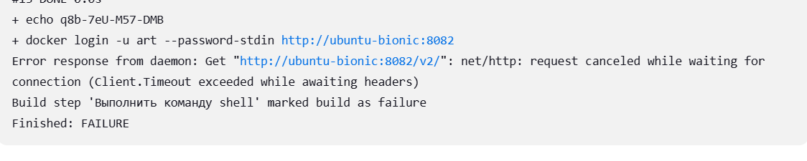

настраиваем NEXUS 
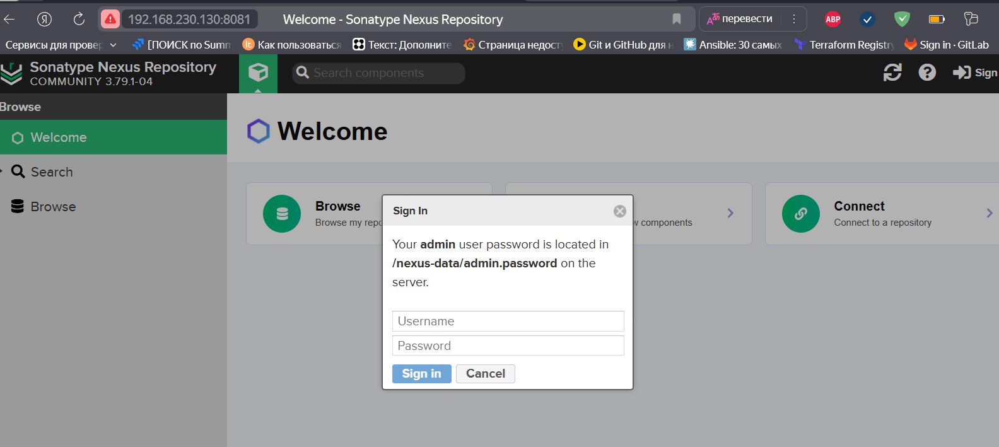
Вывести пароль администратора для первого логина в Nexus:
```
docker exec -t nexus bash -c 'cat /nexus-data/admin.password && echo'
```
настраиваем учетку и создаем репозеторий
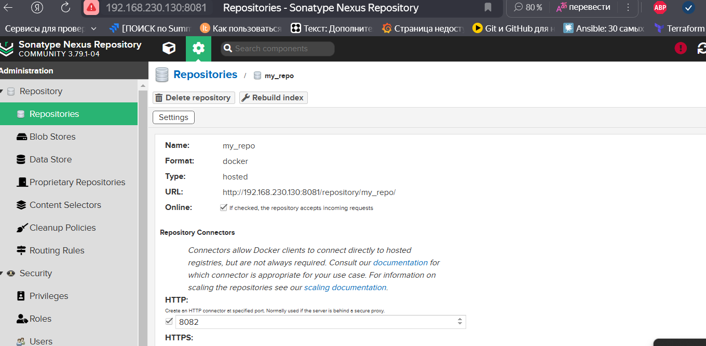
Запускаем джобу
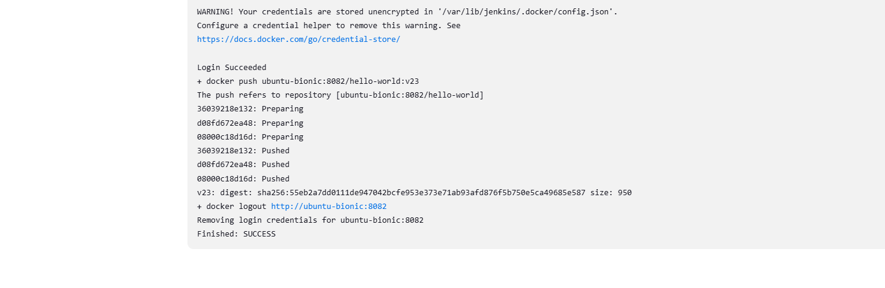
смотрим что в репозитории

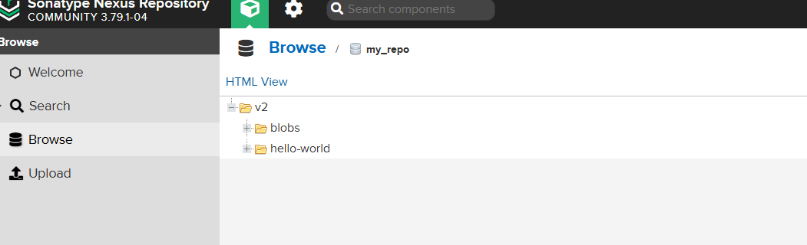